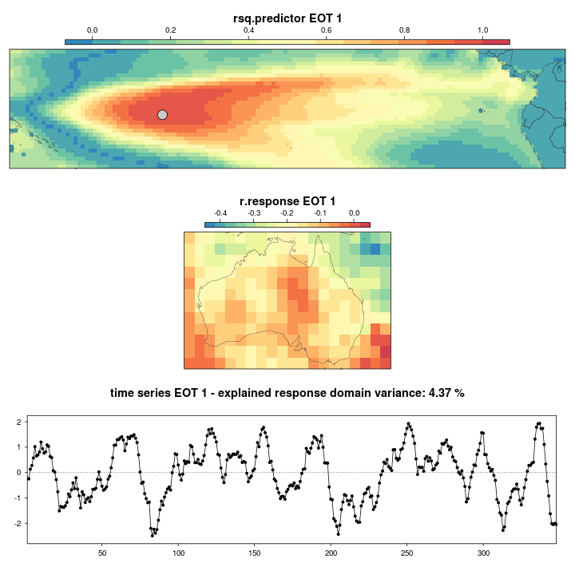
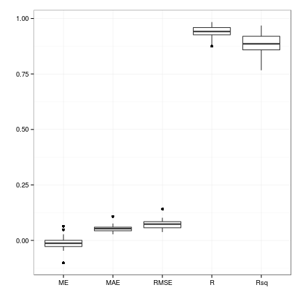
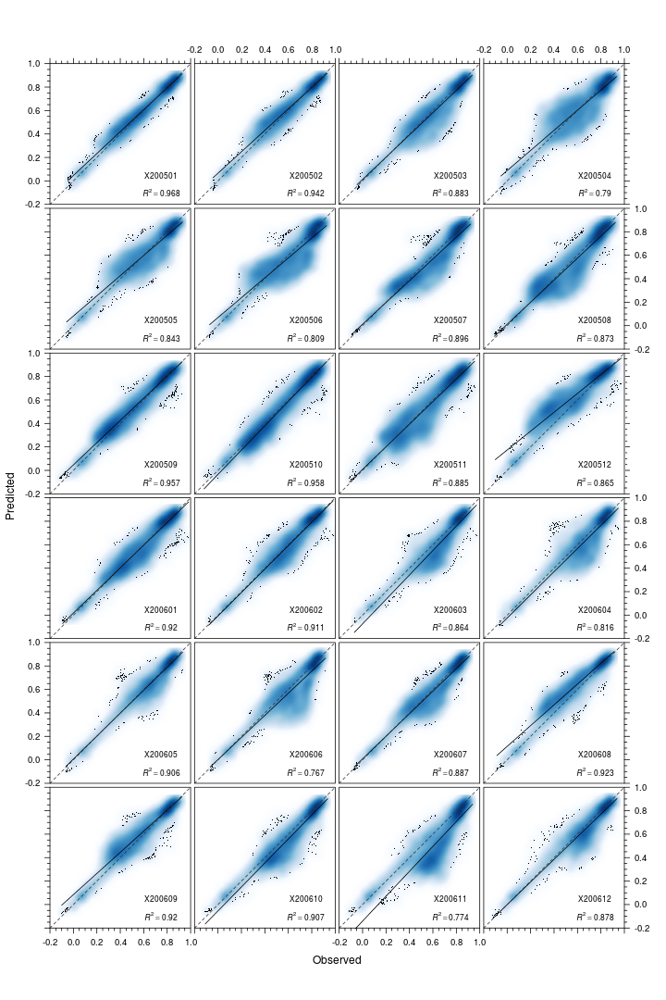
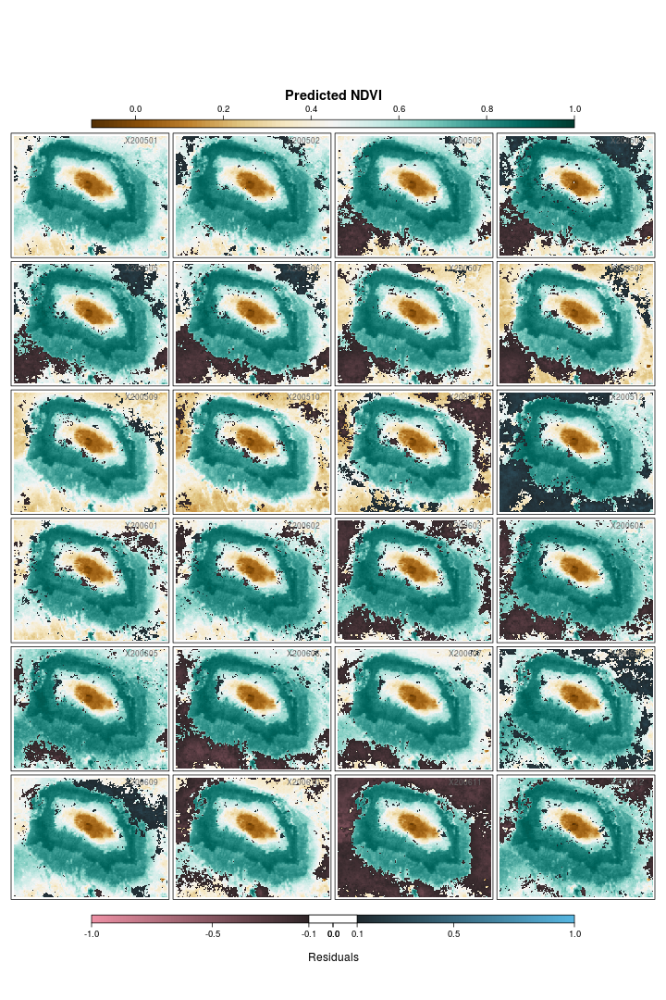
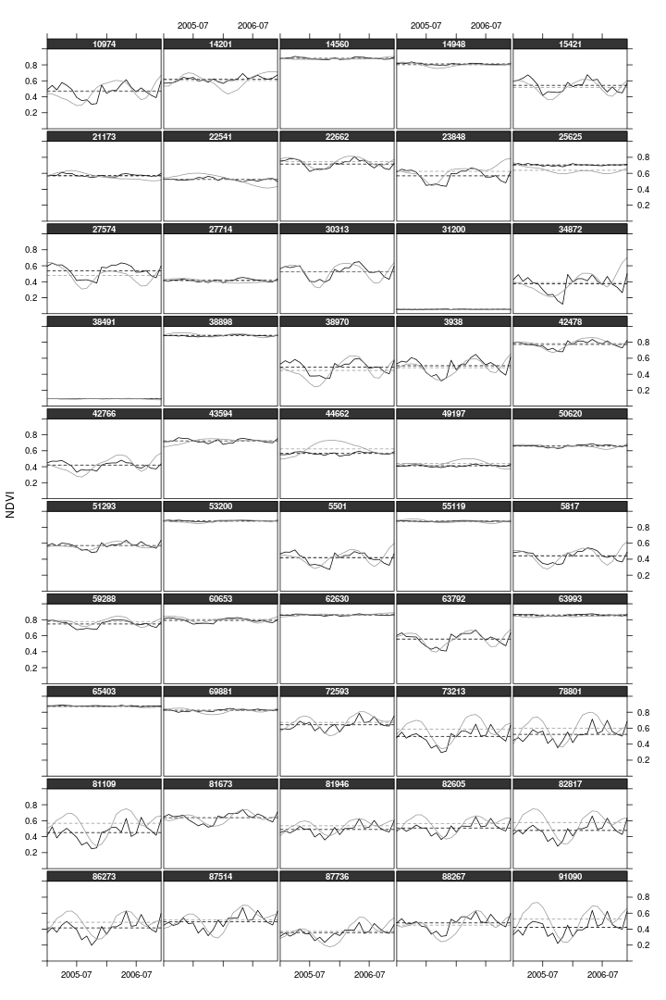

Reot
====

### Empirical Orthogonal Teleconnections in R

for detailed descriptions of the algorithm & methodolgy please have a look at:

**Empirical Orthogonal Teleconnections**   
H. M. van den Dool, S. Saha, Å Johansson   
Journal of Climate, Volume 13, Issue 8 (April 2000) pp. 1421-1435   
[http://journals.ametsoc.org/doi/abs/10.1175/1520-0442%282000%29013%3C1421%3AEOT%3E2.0.CO%3B2](http://journals.ametsoc.org/doi/abs/10.1175/1520-0442%282000%29013%3C1421%3AEOT%3E2.0.CO%3B2)

**Empirical methods in short-term climate prediction**   
H. M. van den Dool   
Oxford University Press, Oxford, New York (2007)    
[http://www.oup.com/uk/catalogue/?ci=9780199202782](http://www.oup.com/uk/catalogue/?ci=9780199202782)

====

### A few examples

====

#### Example I: recreate figure 6 from van den Dool et al. (2000)

```r
library(Reot)

###### EXAMPLE I ##########################################################
###########################################################################
library(rworldmap)
library(rgdal)
library(rgeos)
library(latticeExtra)

## load data
data(vdendool)
data(coastsCoarse)

## calculate 4 leading modes
modes <- eot(pred = vdendool, resp = NULL, n = 4, reduce.both = FALSE,
             standardised = FALSE, print.console = TRUE)
```

```
## 
## Calculating linear model ... 
## Locating 1. EOT ...
## Location: -35 77.67 
## Cum. expl. variance (%): 21.53 
## 
## Calculating linear model ... 
## Locating 2. EOT ...
## Location: -165 43.15 
## Cum. expl. variance (%): 38.17 
## 
## Calculating linear model ... 
## Locating 3. EOT ...
## Location: 85 67.81 
## Cum. expl. variance (%): 46.08 
## 
## Calculating linear model ... 
## Locating 4. EOT ...
## Location: -25 53.01 
## Cum. expl. variance (%): 53.07
```

```r

## create coastal outlines
ster <- CRS("+proj=stere +lat_0=90 +lon_0=-45")
xmin <- -180
xmax <- 180
ymin <- 20
ymax <- 90     # Coordinates for bounding box
bb <- cbind(x = c(xmin, xmin, xmax, xmax, xmin), 
            y = c(ymin, ymax, ymax, ymin, ymin))    #Create bounding box
SP <- SpatialPolygons(list(Polygons(list(Polygon(bb)), "1")), 
                      proj4string = CRS(proj4string(coastsCoarse)))

gI <- gIntersects(coastsCoarse, SP, byid = TRUE) 
out <- vector(mode = "list", length = length(which(gI))) 
ii <- 1

for (i in seq(along = gI)) if (gI[i]) {
  out[[ii]] <- gIntersection(coastsCoarse[i, ], SP)
  row.names(out[[ii]]) <- row.names(coastsCoarse)[i]
  ii <- ii + 1
}

nhem.coasts <- do.call("rbind", out)
nhem.coasts.ster <- spTransform(nhem.coasts, ster) 

lout <- list("sp.lines", nhem.coasts.ster, 
             col = "grey30", grid = TRUE)

## define colours
clrs <- colorRampPalette(rev(brewer.pal(9, "RdBu")))

## project modes to polar stereographic CRS
mode <- lapply(seq(modes), function(i) {
  projectRaster(modes[[i]]$r.predictor, crs = ster)
})

## create title for each panel
title <- lapply(seq(mode), function(i) {
  paste("Mode ", i, " : ", "EV = ", 
        round(if (i > 1) {
          modes[[i]]$exp.var * 100 - 
            modes[[i - 1]]$exp.var * 100
        } else {
          modes[[i]]$exp.var * 100
        }, 1), " : ", "BP = ", as.integer(modes[[i]]$loc.eot[, 1]), 
        ", ", as.integer(modes[[i]]$loc.eot[, 2]), sep = "")
})

## create panel plots
p <- lapply(seq(mode), function(i) {
  spplot(mode[[i]], sp.layout = lout, main = list(title[[i]], cex = 0.7),
         col.regions = clrs(1000), at = seq(-1, 1, 0.2),
         par.settings = list(axis.line = list(col = 0)),
         colorkey = list(height = 0.75, width = 1))
})

f <- function(...) grid.arrange(..., heights = 1, ncol = 2)
do.call(f, p)   #Final plot
```

```
## Error: could not find function "grid.arrange"
```

```r
###########################################################################
###########################################################################
```


====

#### Example II: identifying tropical Pacific Ocean SST drivers for Australian precipitation


```r
###### EXAMPLE II #########################################################
###########################################################################
data("australiaGPCP")
data("pacificSST")

### deseason data
sst.pred <- deseason(pacificSST, cycle.window = 12)
gpcp.resp <- deseason(australiaGPCP, cycle.window = 12)

### denoise data (keeping 90 % of the variance)
sst.pred.dns <- denoise(sst.pred, expl.var = 0.9)
```

```
## 
## Using the first 19 components (of 348) to reconstruct series...
##  these account for 0.9 of variance in orig. series
```

```r
gpcp.resp.dns <- denoise(gpcp.resp, expl.var = 0.9)
```

```
## 
## Using the first 37 components (of 348) to reconstruct series...
##  these account for 0.9 of variance in orig. series
```

```r

### calculate first 3 leading modes
modes <- eot(pred = sst.pred.dns, resp = gpcp.resp.dns, n = 3, 
             standardised = FALSE, reduce.both = FALSE,
             print.console = TRUE)
```

```
## 
## Calculating linear model ... 
## Locating 1. EOT ...
## Location: 188.5 -1.5 
## Cum. expl. variance (%): 4.372 
## 
## Calculating linear model ... 
## Locating 2. EOT ...
## Location: 173.5 -10.5 
## Cum. expl. variance (%): 5.39 
## 
## Calculating linear model ... 
## Locating 3. EOT ...
## Location: 150.5 -12.5 
## Cum. expl. variance (%): 5.847
```

```r

### plot first EOT showing the location of the base point
plotEot(modes, eot = 1, show.eot.loc = TRUE, arrange = "long")
```

 

```r
###########################################################################
###########################################################################
```


====

#### Example III: downscale 8 km GIMMS NDVI to 250 m MODIS NDVI


```r
###### EXAMPLE III ########################################################
###########################################################################
library(ggplot2)
library(reshape)

data("gimmsKiliNDVI")
data("modisKiliNDVI")

### define index for training data
pred.ind <- 1:24

### create training (pred) and evaluation (eval) sets
mod.stck.pred <- modisKiliNDVI[[pred.ind]]
mod.stck.eval <- modisKiliNDVI[[-pred.ind]]
gimms.stck.pred <- gimmsKiliNDVI[[pred.ind]]
gimms.stck.eval <- gimmsKiliNDVI[[-pred.ind]]

### calculate EOT
modes <- eot(pred = gimms.stck.pred, resp = mod.stck.pred, n = 10, 
             standardised = FALSE, reduce.both = FALSE, 
             print.console = TRUE)
```

```
## 
## Calculating linear model ... 
## Locating 1. EOT ...
## Location: 37.5 -2.886 
## Cum. expl. variance (%): 86.65 
## 
## Calculating linear model ... 
## Locating 2. EOT ...
## WARNING: 
##  LOCATION OF EOT AMBIGUOUS! MULTIPLE POSSIBLE LOCATIONS DETECTED, 
##         USING ONLY THE FIRST!
## 
## Location: 37.2 -3.395 
## Cum. expl. variance (%): 90.22 
## 
## Calculating linear model ... 
## Locating 3. EOT ...
## Location: 37.28 -3.104 
## Cum. expl. variance (%): 91.5 
## 
## Calculating linear model ... 
## Locating 4. EOT ...
## Location: 37.42 -3.032 
## Cum. expl. variance (%): 92.32 
## 
## Calculating linear model ... 
## Locating 5. EOT ...
## WARNING: 
##  LOCATION OF EOT AMBIGUOUS! MULTIPLE POSSIBLE LOCATIONS DETECTED, 
##         USING ONLY THE FIRST!
## 
## Location: 37.13 -2.959 
## Cum. expl. variance (%): 93.02 
## 
## Calculating linear model ... 
## Locating 6. EOT ...
## Location: 37.35 -2.959 
## Cum. expl. variance (%): 93.62 
## 
## Calculating linear model ... 
## Locating 7. EOT ...
## Location: 37.06 -3.395 
## Cum. expl. variance (%): 94.13 
## 
## Calculating linear model ... 
## Locating 8. EOT ...
## Location: 37.64 -3.395 
## Cum. expl. variance (%): 94.77 
## 
## Calculating linear model ... 
## Locating 9. EOT ...
## Location: 37.42 -3.104 
## Cum. expl. variance (%): 95.18 
## 
## Calculating linear model ... 
## Locating 10. EOT ...
## Location: 37.28 -3.25 
## Cum. expl. variance (%): 95.54
```

```r

### calculate number of modes necessary for explaining 95% variance
nmodes <- nEot4Var(modes, 0.95)

### extract identified time series (max.xy) of GIMMS evaluation set
ts.mode.eval <- sapply(seq(nmodes), function(i) {
  gimms.stck.eval[modes[[i]]$max.xy]
})

### prediction using claculated intercept, slope and GIMMS NDVI values
mod.predicted.stck <- lapply(seq(nlayers(mod.stck.eval)), function(i) {
  stack(lapply(seq(ncol(ts.mode.eval)), function(k) {
    modes[[k]]$int.response + 
      modes[[k]]$slp.response * ts.mode.eval[i, k]
  }))
})

### summate prediction for each mode at each time step
mod.predicted <- stack(lapply(seq(nrow(ts.mode.eval)), function(i) {
  calc(mod.predicted.stck[[i]], fun = sum)
}))

mod.observed <- mod.stck.eval

pred.vals <- getValues(mod.predicted)
obs.vals <- getValues(mod.observed)

### error scores
ME <- colMeans(pred.vals - obs.vals, na.rm = TRUE)
MAE <- colMeans(abs(pred.vals - obs.vals), na.rm = TRUE)
RMSE <- sqrt(colMeans((pred.vals - obs.vals)^2, na.rm = TRUE))
R <- diag(cor(pred.vals, obs.vals, use = "complete.obs"))
Rsq <- R * R


### visualise error scores
scores <- data.frame(ME, MAE, RMSE, R, Rsq)
melt.scores <- melt(scores)

p <- ggplot(melt.scores, aes(factor(variable), value)) 
p <- p + geom_boxplot() + 
  theme_bw() + xlab("") + ylab("")
print(p)
```

 


```r
## density scatter plot
lattice.plots <- lapply(seq(ncol(pred.vals)), function(i) {
  
  panel.name <- strsplit(names(mod.stck.eval)[i], "_")[[1]][4]
  
  eval.dat <- data.frame(pred = obs.vals[, i], resp = pred.vals[, i])
  scatter.lattice <- xyplot(resp ~ pred, aspect = 1,
                            ylim = c(-0.2, 1), xlim = c(-0.2, 1),
                            data = eval.dat, ylab = "Predicted", 
                            xlab = "Observed",
                            panel = function(x, y, ...) {
                              panel.smoothScatter(x, y, nbin = 500, 
                                                  raster = TRUE, ...)
                              lm1 <- lm(y ~ x)
                              lm1sum <- summary(lm1)
                              r2 <- lm1sum$adj.r.squared
                              panel.text(labels = 
                                           bquote(italic(R)^2 == 
                                                    .(format(r2, 
                                                             digits = 3))),
                                         x = 0.75, y = -0.1, cex = 0.7)
                              panel.text(labels = panel.name,
                                         x = 0.75, y = 0.05, cex = 0.7)
                              panel.smoother(x, y, method = "lm", 
                                             col = "black", 
                                             col.se = "black",
                                             alpha.se = 0.3, ...)
                              panel.abline(a = 0, b = 1, 
                                           col = "grey20", lty = 2, ...)
                            },
                            xscale.components = xscale.components.subticks,
                            yscale.components = yscale.components.subticks,
                            as.table = TRUE)
  
  return(scatter.lattice)
  
})

outLayout <- function(x, y) {
  update(c(x, y, 
           layout = c(4, length(lattice.plots)/4)), 
         between = list(y = 0.3, x = 0.3))
}

out <- Reduce(outLayout, lattice.plots)

print(out)
```

 


```r
## spatial residuals plot
clrs.hcl <- function(n) {
  hcl(h = seq(230, 0, length.out = n), 
      c = 60, l = 70, fixup = TRUE)
}

clrs.ndvi <- colorRampPalette(brewer.pal(11, "BrBG"))
clrs.resids <- colorRampPalette(c(clrs.hcl(2)[2], 
                                  "grey10",
                                  clrs.hcl(2)[1]))

plotResid <- function(pred.rst,
                      resp.rst,
                      bg = NULL,
                      txt = "",
                      n = 5000) {
  
  if (is.null(bg)) bg <- resp.rst
  
  lm1 <- resp.rst - pred.rst

  highest.pix <- pred.rst
  highest.pix[] <- NA
  highest.pix[which(values(lm1) > 0.1)] <- lm1[which(values(lm1) > 0.1)]
  lowest.pix <- pred.rst
  lowest.pix[] <- NA
  lowest.pix[which(values(lm1) < -0.1)] <- lm1[which(values(lm1) < -0.1)]
  
  lev <- spplot(bg, col.regions = clrs.ndvi(1200), 
                at = seq(-0.1, 1, 0.01), as.table = TRUE, 
                main = "Predicted NDVI",
                colorkey = list(space = "top", width = 1, height = 0.75))
  lowest.lev <- spplot(lowest.pix, col.regions = clrs.resids(1200),
                       at = seq(-1, 1, 0.01), 
                       colorkey = FALSE, as.table = TRUE)
  highest.lev <- spplot(highest.pix, col.regions = clrs.resids(1200),
                        at = seq(-1, 1, 0.01), 
                        colorkey = FALSE, as.table = TRUE,
                        panel = function(...) {
                          panel.levelplot(...)
                          panel.text(labels = txt, col = "grey40",
                                     x = 37.6, y = -2.86, cex = 0.7)})

  out <- lev + as.layer(lowest.lev) + as.layer(highest.lev)
  
  return(out)
}

resid.plot <- lapply(seq(ncol(pred.vals)), function(i) {
  
  panel.name <- strsplit(names(mod.stck.eval)[i], "_")[[1]][4]
  
  plotResid(pred.rst = mod.observed[[i]],
            resp.rst = mod.predicted[[i]],
            bg = NULL,
            txt = panel.name,
            n = 5000) 
})

outLayout <- function(x, y) {
  update(c(x, y, 
           layout = c(4, length(resid.plot)/4)), 
         between = list(y = 0.3, x = 0.3))
}

out.res <- Reduce(outLayout, resid.plot)

print(out.res) 
downViewport(trellis.vpname(name = "figure"))
vp1 <- viewport(x = 0.5, y = 0,
                height = 0.07, width = 0.75,
                just = c("centre", "top"),
                name = "key.vp")
pushViewport(vp1)
draw.colorkey(key = list(col = clrs.resids(1200), width = 1,
                         at = seq(-1, 1, 0.01),
                         space = "bottom"), draw = TRUE)
```

```
## frame[plot_01.colorkey.frame]
```

```r
upViewport()
vp2 <- viewport(x = 0.5, y = 0,
                height = 0.07, width = 0.075,
                just = c("centre", "top"),
                name = "key.vp")
pushViewport(vp2)
draw.colorkey(key = list(col = "white", width = 1,
                         at = seq(-0.1, 0.1, 0.1),
                         tick.number = 2,
                         space = "bottom"), draw = TRUE)
```

```
## frame[plot_01.colorkey.frame]
```

```r
grid.text("Residuals", x = 0.5, y = 0, just = c("centre", "top"))
```

 


```r
## time series comparison
set.seed(123)
excl.cells <- attributes(na.exclude(mod.predicted[[1]][]))$na.action
"%w/o%" <- function(x, y) x[!x %in% y]
valid.cells <- seq(mod.predicted[[1]][]) %w/o% excl.cells
kili.sites <- sample(valid.cells, 50, replace = FALSE)

time <- seq.Date(as.Date("2005-01-01"), as.Date("2006-12-31"), 
                 by = "months")

p.vals <- as.data.frame(extract(mod.predicted, kili.sites))
names(p.vals) <- time
p.vals$pID <- as.character(kili.sites)
p.vals.long <- melt(p.vals)

o.vals <- as.data.frame(extract(mod.observed, kili.sites))
names(o.vals) <- time
o.vals$pID <- as.character(kili.sites)
o.vals.long <- melt(o.vals)

pred.p <- xyplot(value ~ as.Date(variable) | pID, data = p.vals.long, 
                 type = "l", as.table = TRUE, layout = c(5, 10),
                 par.settings = list(layout.heights = list(strip = 0.75)),
                 between = list(y = 0.2, x = 0.2), col = "black",
                 ylab = "NDVI", xlab = "",
                 panel = function(x, y, ...) {
                   panel.xyplot(x, y, ...)
                   panel.abline(h = mean(y), lty = 2)
                 },
                 strip = strip.custom(
                   bg = "grey20", par.strip.text = list(col = "white", 
                                                        font = 2, 
                                                        cex = 0.8)),
                 ylim = c(0, 1),
                 xlim = c(as.Date(p.vals.long$variable[1]), 
                          as.Date(p.vals.long$variable[nrow(p.vals.long)])))

obs.p <- xyplot(value ~ as.Date(variable) | pID, data = o.vals.long, 
                type = "l", as.table = TRUE, col = "grey60",
                panel = function(x, y, ...) {
                  panel.xyplot(x, y, ...)
                  panel.abline(h = mean(y), lty = 2, col = "grey60")
                })

pred.p + as.layer(obs.p)
```

 

```r
###########################################################################
###########################################################################
```


====
