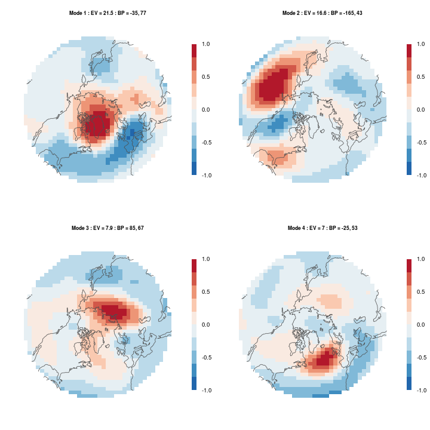
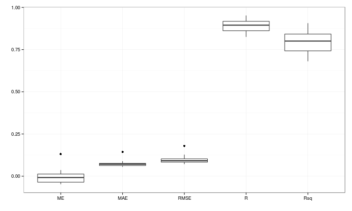
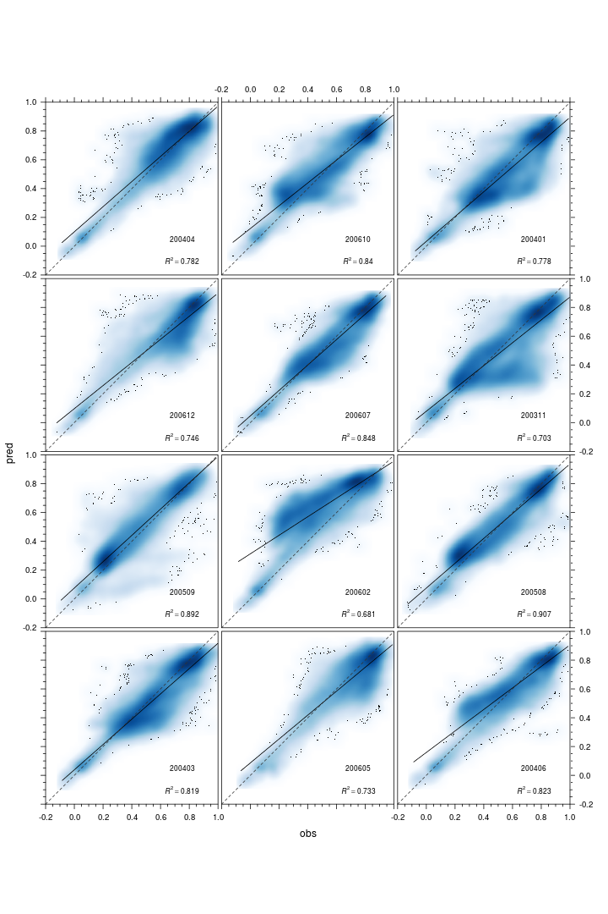

Reot
====

### Empirical Orthogonal Teleconnections in R

for detailed descriptions of the algorithm & methodolgy please have a look at:

**Empirical Orthogonal Teleconnections**   
H. M. van den Dool, S. Saha, Å Johansson   
Journal of Climate, Volume 13, Issue 8 (April 2000) pp. 1421-1435   
[http://journals.ametsoc.org/doi/abs/10.1175/1520-0442%282000%29013%3C1421%3AEOT%3E2.0.CO%3B2](http://journals.ametsoc.org/doi/abs/10.1175/1520-0442%282000%29013%3C1421%3AEOT%3E2.0.CO%3B2)

**Empirical methods in short-term climate prediction**   
H. M. van den Dool   
Oxford University Press, Oxford, New York (2007)    
[http://www.oup.com/uk/catalogue/?ci=9780199202782](http://www.oup.com/uk/catalogue/?ci=9780199202782)

====

### A few examples

====

#### Example I: recreate figure 6 from van den Dool et al. (2000)

```S
library(Reot)
library(rworldmap)
library(rgdal)
library(rgeos)

data(vdendool)
data(coastsCoarse)

modes <- eot(pred = vdendool, resp = NULL, n = 4,
             standardised = FALSE) 
```

```
## Calculating linear model ... 
## Locating 1. EOT ...
## location: -35 77.67 
## max rsq value: 52001 
## 
## Calculating linear model ... 
## Locating 2. EOT ...
## location: -165 43.15 
## max rsq value: 39002 
## 
## Calculating linear model ... 
## Locating 3. EOT ...
## location: 85 67.81 
## max rsq value: 19014 
## 
## Calculating linear model ... 
## Locating 4. EOT ...
## location: -25 53.01 
## max rsq value: 16459
```

```S

ster <- CRS("+proj=stere +lat_0=90 +lon_0=-45")

xmin <- -180
xmax <- 180
ymin <- 20
ymax <- 90     # Coordinates for bounding box
bb <- cbind(x = c(xmin, xmin, xmax, xmax, xmin), 
            y = c(ymin, ymax, ymax, ymin, ymin))    #Create bounding box
SP <- SpatialPolygons(list(Polygons(list(Polygon(bb)), "1")), 
                      proj4string = CRS(proj4string(coastsCoarse)))

gI <- gIntersects(coastsCoarse, SP, byid = TRUE) 
out <- vector(mode = "list", length = length(which(gI))) 
ii <- 1

for (i in seq(along = gI)) if (gI[i]) {
  out[[ii]] <- gIntersection(coastsCoarse[i, ], SP)
  row.names(out[[ii]]) <- row.names(coastsCoarse)[i]
  ii <- ii + 1
}

nhem.coasts <- do.call("rbind", out)
nhem.coasts.ster <- spTransform(nhem.coasts, ster) 

lout <- list("sp.lines", nhem.coasts.ster, 
             col = "grey30", grid = TRUE)

clrs <- colorRampPalette(rev(brewer.pal(9, "RdBu")))

mode1 <- projectRaster(modes[[1]]$EOT_1$r.predictor, crs = ster)
mode2 <- projectRaster(modes[[1]]$EOT_2$r.predictor, crs = ster)
mode3 <- projectRaster(modes[[1]]$EOT_3$r.predictor, crs = ster)
mode4 <- projectRaster(modes[[1]]$EOT_4$r.predictor, crs = ster)

p1 <- spplot(mode1, sp.layout = lout, main = "Mode 1",
             col.regions = clrs(1000), at = seq(-1, 1, 0.02))
p2 <- spplot(mode2, sp.layout = lout, main = "Mode 2",
             col.regions = clrs(1000), at = seq(-1, 1, 0.02))
p3 <- spplot(mode3, sp.layout = lout, main = "Mode 3",
             col.regions = clrs(1000), at = seq(-1, 1, 0.02))
p4 <- spplot(mode4, sp.layout = lout, main = "Mode 4",
             col.regions = clrs(1000), at = seq(-1, 1, 0.02))

grid.arrange(p1, p2, p3, p4,
             heights = 1, ncol = 2)
```

 


====

#### Example II: downscale 8 km GIMMS NDVI to 250 m MODIS NDVI


```S
library(reshape)
library(ggplot2)

data(modisKiliNDVI)
data(gimmsKiliNDVI)

# create training and validation sets
set.seed(123)
layer <- sample(c(0,1,2,3), nlayers(modisKiliNDVI), replace = TRUE)
month <- sample(12, 12, replace = FALSE)

pred.ind1 <- (layer * 12 + month)[1:12]

mod.stck.pred <- modisKiliNDVI[[-pred.ind1]]
mod.stck.eval <- modisKiliNDVI[[pred.ind1]]
gimms.stck.pred <- gimmsKiliNDVI[[-pred.ind1]]
gimms.stck.eval <- gimmsKiliNDVI[[pred.ind1]]

# calculate eot (n = 2 is needed because of a bug)
mode <- eot(pred = gimms.stck.pred,
            resp = mod.stck.pred, n = 2)
```

```
## Calculating linear model ... 
## Locating 1. EOT ...
## location: 37.71 -3.25 
## max rsq value: 24443 
## 
## Calculating linear model ... 
## Locating 2. EOT ...
## location: 37.28 -3.323 
## max rsq value: 10305
```

```S

### evaluate prediction
ts.mode.eval <- gimms.stck.eval[mode[[1]][[1]]$max.xy]

mod.predicted <- stack(lapply(seq(nlayers(mod.stck.eval)), function(i) {
  mode[[1]][[1]]$int.response + mode[[1]][[1]]$slp.response * ts.mode.eval[i]
}))
mod.observed <- mod.stck.eval

pred.vals <- getValues(mod.predicted) / 10000
obs.vals <- getValues(mod.observed) / 10000

# error scores
ME <- colMeans(pred.vals - obs.vals, na.rm = TRUE)
MAE <- colMeans(abs(pred.vals - obs.vals), na.rm = TRUE)
RMSE <- sqrt(colMeans((pred.vals - obs.vals)^2, na.rm = TRUE))
R <- diag(cor(pred.vals, obs.vals, use = "complete.obs"))
Rsq <- R * R


# visualise error scores
scores <- data.frame(ME, MAE, RMSE, R, Rsq)
melt.scores <- melt(scores)

# boxplots
#png("scores_boxplots.png", width = 10, height = 10, units = "cm", res = 300)
p <- ggplot(melt.scores, aes(factor(variable), value)) 
p + geom_boxplot() + 
  theme_bw() + xlab("") + ylab("")#+ facet_wrap(~variable, scale="free")
```

 

```S
#dev.off()
```


```S
# scatter plots
# lattice-way
lattice.plots <- lapply(seq(ncol(pred.vals)), function(i) {
  
  panel.name <- strsplit(names(mod.stck.eval)[i], "_")[[1]][4]
  
  eval.dat <- data.frame(pred = pred.vals[, i], obs = obs.vals[, i])
  scatter.lattice <- xyplot(pred ~ obs, aspect = 1,
                            ylim = c(-0.2, 1), xlim = c(-0.2, 1),
                            data = eval.dat, 
                            panel = function(x, y, ...) {
                              panel.smoothScatter(x, y, nbin = 500, 
                                                  raster = TRUE, ...)
                              lm1 <- lm(y ~ x)
                              lm1sum <- summary(lm1)
                              r2 <- lm1sum$adj.r.squared
                              panel.text(labels = 
                                           bquote(italic(R)^2 == 
                                                    .(format(r2, 
                                                             digits = 3))),
                                         x = 0.75, y = -0.1, cex = 0.7)
                              panel.text(labels = panel.name,
                                         x = 0.75, y = 0.05, cex = 0.7)
                              panel.smoother(x, y, method = "lm", 
                                             col = "black", 
                                             col.se = "black",
                                             alpha.se = 0.3, ...)
                              panel.abline(a = 0, b = 1, 
                                           col = "grey20", lty = 2, ...)
                            },
                            xscale.components = xscale.components.subticks,
                            yscale.components = yscale.components.subticks,
                            as.table = TRUE)
  
  return(scatter.lattice)
  
})

outLayout <- function(x, y) {
  update(c(x, y, 
           layout = c(3, length(lattice.plots)/3)), 
         between = list(y = 0.3, x = 0.3))
}

out <- Reduce(outLayout, lattice.plots)

#png("scatter.png", width = 19, height = 27, units = "cm", res = 300)
print(out)
```

 

```S
#dev.off()
```


====
